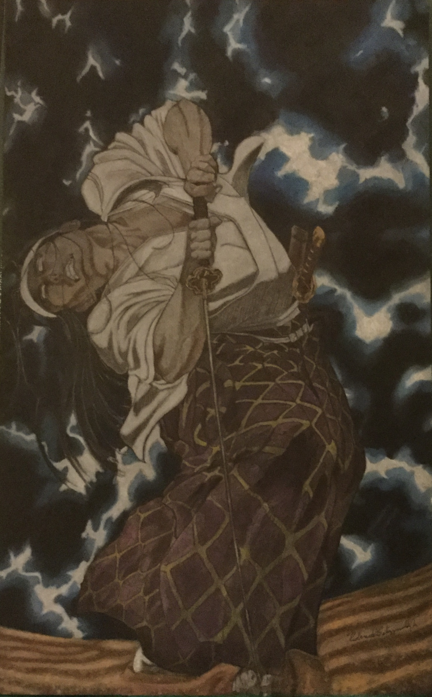

<!DOCTYPE html>
<html>
<html lang="en">
<head>
    <meta charset="utf-8">
    <meta name="viewport" content="width=device-width, initial-scale=1.0"/>
    <title>Repo-Clone_Exercise</title>
    <link rel="stylesheet" href="C:\Users\Liber\Documents\Projects\repo-clone-exercise\clone-exercise.html\styles.css"/>
</head>
<body>
<main>
    <h1>Roderick Fitzgerald<h1>
<section>
    <h2>About Me<h2>
<figure>
    Irako Seigen</figcaption>
</figure>
    
I joined Code:You to learn software development and later learn web design. I love learning new things and there is nothing better than learning new skills that can kick start a new career.

</section>
<section>
    <h3>Hobbies</h3>
<ul>
    <li>Art</li>
    <li>Music</li>
    <li>Exercise</li>
</ul>
</section>
</main>
<footer></footer>
</body>
</html>